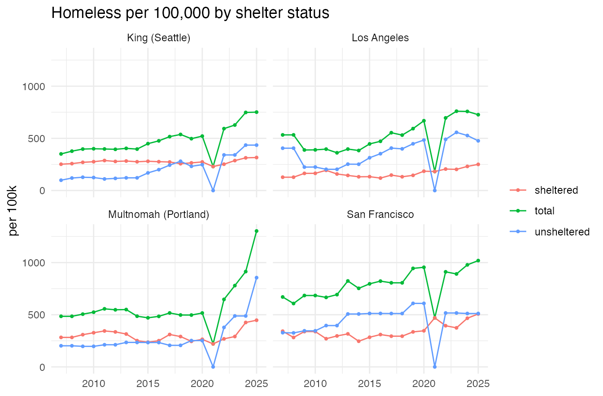
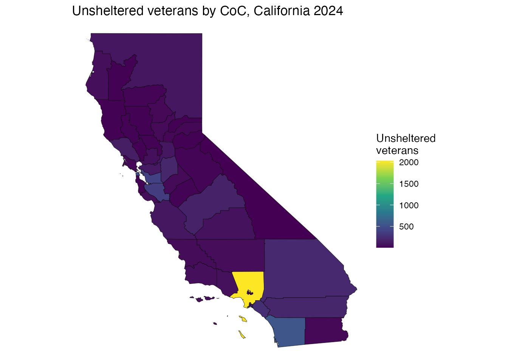
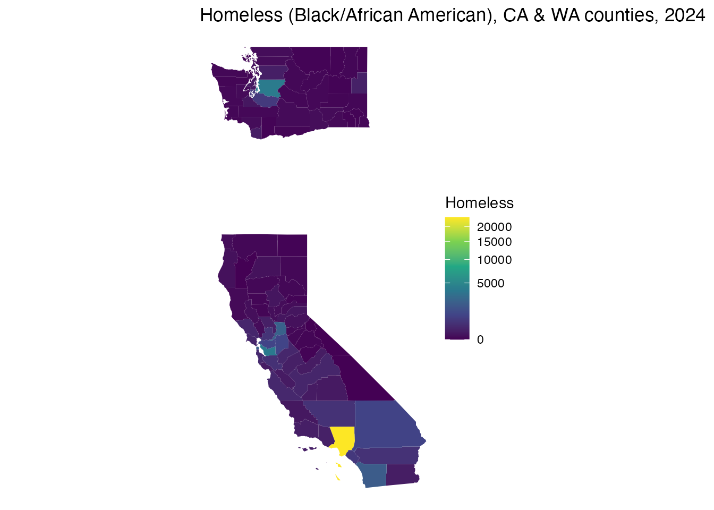
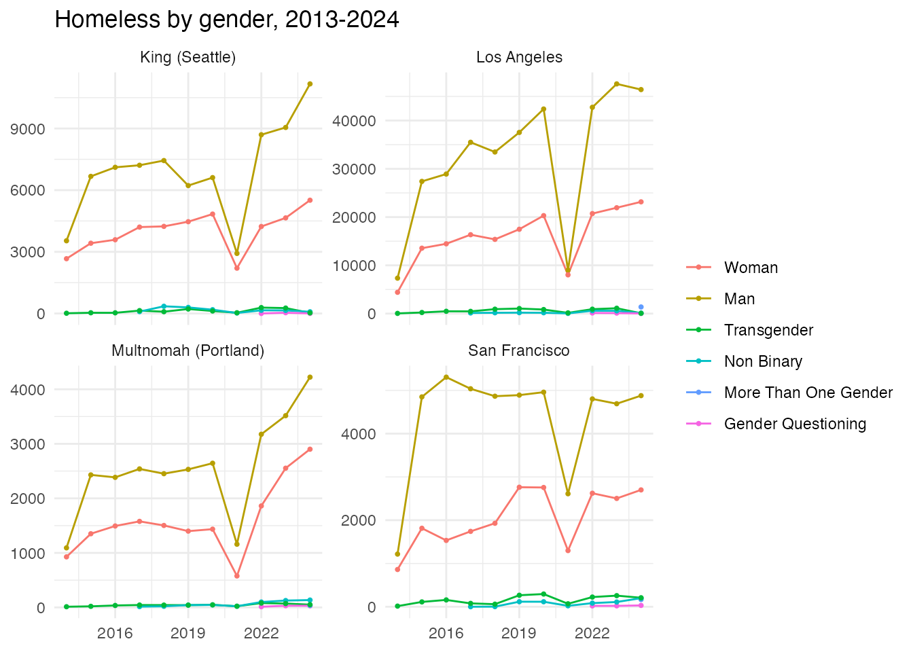
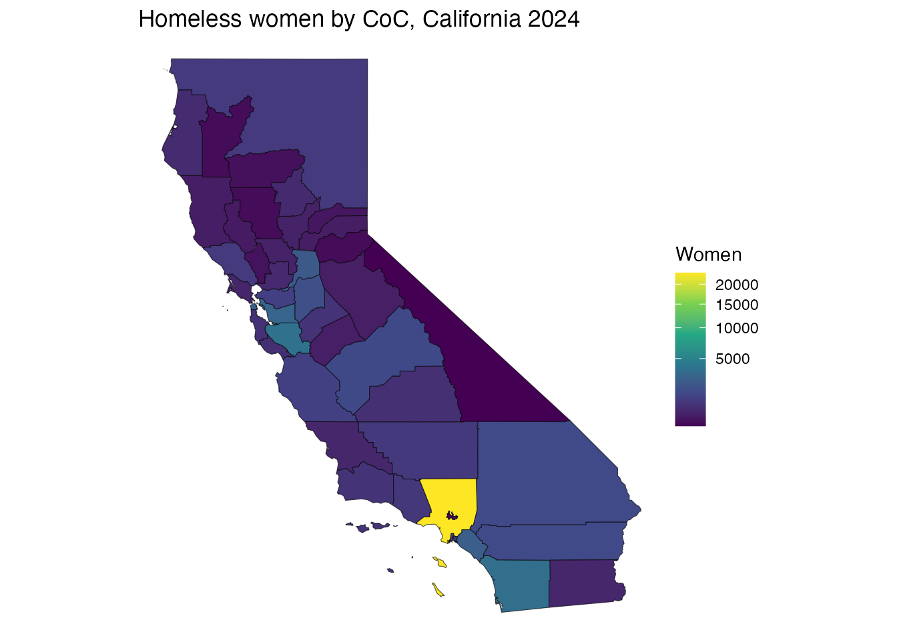

# Census-to-CoC crosswalk

``` r

library(COCHomeless)
```

The crosswalk datasets link Census geography to HUD Continuum of Care
(CoC) areas, in both directions:

- `tract_coc2019` / `tract_coc2022` – a hard assignment of each census
  tract to the CoC containing it.
- `tract_coc_wt2019` – area weights for tracts that straddle a CoC
  border.
- `county_coc2019` – county \<-\> CoC area weights (`w_coc` apportions a
  CoC down to counties; `w_county` aggregates a county up to CoCs).

The crosswalk procedure is due to Tom Byrne (Boston University); please
credit Byrne when using these data.

## National overview

``` r

nrow(tract_coc2019)                       # ~73k tracts assigned
#> [1] 73666
length(unique(tract_coc2019$COCNUM))      # ~394 CoCs
#> [1] 395
# tracts that split across more than one CoC (area-weighted file)
sum(table(tract_coc_wt2019$GEOID) > 1)
#> [1] 10168
```

## Focus: a California and a Washington CoC

List the counties that make up Seattle/King County (WA-500) and how much
of the CoC falls in each, using the area weights:

``` r

# use subset() (or which()): some tracts have NA COCNUM, and indexing a data
# frame with a logical vector containing NA returns spurious NA rows.
wa500 <- subset(county_coc2019, COCNUM == "WA-500")
wa500[order(-wa500$w_coc), c("fips", "w_coc")]
#> # A tibble: 5 × 2
#>   fips     w_coc
#>   <chr>    <dbl>
#> 1 53033 0.990   
#> 2 53061 0.00411 
#> 3 53053 0.00340 
#> 4 53037 0.00225 
#> 5 53007 0.000557
```

The tracts assigned to San Francisco’s CoC (CA-501):

``` r

ca501 <- subset(tract_coc2019, COCNUM == "CA-501")
head(ca501[, c("GEOID", "fips", "COCNAME")])
#>            GEOID  fips           COCNAME
#> 9833 06075010100 06075 San Francisco CoC
#> 9834 06075010200 06075 San Francisco CoC
#> 9835 06075010300 06075 San Francisco CoC
#> 9836 06075010400 06075 San Francisco CoC
#> 9837 06075010500 06075 San Francisco CoC
#> 9838 06075010600 06075 San Francisco CoC
nrow(ca501)
#> [1] 195
```

## Aggregating an ACS variable up to a CoC

Pull a tract-level American Community Survey variable and aggregate it
to CoCs using the area weights. (Requires a Census API key; not run
here.)

``` r

library(tidycensus)
library(dplyr)
# tract population for Washington
pop <- get_acs("tract", variables = "B01003_001", state = "WA",
               year = 2019, survey = "acs5")
tract_coc_wt2019 %>%
  inner_join(pop, by = c("GEOID")) %>%
  group_by(COCNUM, COCNAME) %>%
  summarise(coc_population = sum(estimate * w_tract), .groups = "drop") %>%
  arrange(desc(coc_population))
```

## Homelessness by shelter status, four metro counties

`county_pit` gives county sheltered / unsheltered / total estimates.
Per-capita rates (per 100,000) for Los Angeles, San Francisco, Multnomah
(Portland) and King (Seattle), 2007–2025. The 2021 drop in unsheltered
counts is HUD’s COVID-19 waiver.

``` r

library(ggplot2)
places <- data.frame(
  place = c("Los Angeles", "San Francisco", "Multnomah (Portland)", "King (Seattle)"),
  fips  = c("06037", "06075", "41051", "53033"))
pop <- setNames(homeless$population, homeless$fips)
cp <- county_pit[county_pit$fips %in% places$fips, ]
cp$place <- places$place[match(cp$fips, places$fips)]
cp$pop   <- pop[cp$fips]
long <- do.call(rbind, lapply(c("total", "sheltered", "unsheltered"), function(s)
  data.frame(place = cp$place, year = cp$year, status = s,
             per100k = cp[[s]] / cp$pop * 1e5)))
ggplot(long, aes(year, per100k, color = status)) +
  geom_line() + geom_point(size = 0.8) +
  facet_wrap(~ place) +
  labs(title = "Homeless per 100,000 by shelter status", y = "per 100k",
       x = NULL, color = NULL) + theme_minimal()
```



## Mapping a subpopulation onto the spatial data

`pit_coc_detail` (CoC level) and `county_pit_detail` (county level)
carry the full breakdowns – shelter type by subpopulation, including
veterans, chronic, youth, families, and HUD’s gender, race/ethnicity and
age categories. Join them to the spatial objects by `coc_num` (=
`coc20XX$COCNUM`) or `fips`.

``` r

# what subpopulations are available?
grep("Veteran|Female|Male|Black|Asian|White|Age |Chronically|Youth",
     levels(pit_coc_detail$subpopulation), value = TRUE)[1:12]
#>  [1] "Age 18 to 24"                                             
#>  [2] "Age 25 to 34"                                             
#>  [3] "Age 35 to 44"                                             
#>  [4] "Age 45 to 54"                                             
#>  [5] "Age 55 to 64"                                             
#>  [6] "Asian"                                                    
#>  [7] "Asian or Asian American"                                  
#>  [8] "Asian or Asian American and Hispanic/Latina/o"            
#>  [9] "Asian or Asian American Only"                             
#> [10] "Black or African American"                                
#> [11] "Black, African American, or African"                      
#> [12] "Black, African American, or African and Hispanic/Latina/o"
```

Unsheltered veterans by CoC, 2024, mapped:

``` r

library(sf)
#> Linking to GEOS 3.14.1, GDAL 3.12.3, PROJ 9.8.0; sf_use_s2() is TRUE
vets <- subset(pit_coc_detail,
               year == 2024 & shelter == "Unsheltered" & subpopulation == "Veterans")
m <- merge(coc2024, vets[, c("coc_num", "count")], by.x = "COCNUM", by.y = "coc_num")
ggplot(m[m$ST == "CA", ]) +
  geom_sf(aes(fill = count)) +
  scale_fill_viridis_c(name = "Unsheltered\nveterans") +
  labs(title = "Unsheltered veterans by CoC, California 2024") + theme_void()
```



The same at county level (e.g. a race/ethnicity group) joins
`county_pit_detail` to `counties` by `fips`:

``` r

grp <- subset(county_pit_detail,
              year == 2024 & shelter == "Overall" &
              subpopulation == "Black, African American, or African")
cw <- merge(counties[counties$STUSPS %in% c("CA", "WA"), ],
            grp[, c("fips", "count")], by = "fips")
ggplot(cw) + geom_sf(aes(fill = count), color = NA) +
  scale_fill_viridis_c(trans = "sqrt", name = "Homeless") +
  labs(title = "Homeless (Black/African American), CA & WA counties, 2024") +
  theme_void()
```



## Homelessness by gender over time

The 2007–2024 PIT file reports gender (Woman, Man, Transgender, Non
Binary, More Than One Gender, Gender Questioning), available 2013–2024
(HUD dropped it from the 2025 release, so it is `NA` in 2025).
Composition over time for the four metro CoCs:

``` r

gen_levels <- c("Woman", "Man", "Transgender", "Non Binary",
                "More Than One Gender", "Gender Questioning")
metros <- c("Los Angeles" = "CA-600", "San Francisco" = "CA-501",
            "Multnomah (Portland)" = "OR-501", "King (Seattle)" = "WA-500")
g <- subset(pit_coc_detail,
            shelter == "Overall" & coc_num %in% metros &
            as.character(subpopulation) %in% gen_levels & !is.na(count))
g$place  <- names(metros)[match(g$coc_num, metros)]
g$gender <- factor(as.character(g$subpopulation), levels = gen_levels)
ggplot(g, aes(year, count, color = gender)) +
  geom_line() + geom_point(size = 0.7) +
  facet_wrap(~ place, scales = "free_y") +
  labs(title = "Homeless by gender, 2013-2024", y = NULL, x = NULL, color = NULL) +
  theme_minimal()
```



Mapped: women experiencing homelessness by CoC, California 2024:

``` r

w <- subset(pit_coc_detail,
            year == 2024 & shelter == "Overall" & subpopulation == "Woman")
m <- merge(coc2024, w[, c("coc_num", "count")], by.x = "COCNUM", by.y = "coc_num")
ggplot(m[m$ST == "CA", ]) + geom_sf(aes(fill = count)) +
  scale_fill_viridis_c(trans = "sqrt", name = "Women") +
  labs(title = "Homeless women by CoC, California 2024") + theme_void()
```



## CoC codes over time

CoCs merge and are renumbered. Roll a historical code forward to its
surviving CoC with `coc_mergers`:

``` r

head(coc_mergers)
#>   coc_pre coc_post merger_year
#> 1  MI-520   MI-500        2002
#> 2  TN-505   TN-503        2006
#> 3  KS-500   KS-507        2008
#> 4  MI-521   MI-500        2008
#> 5  MI-524   MI-500        2008
#> 6  MN-507   MN-503        2008
resolve_coc <- function(code, mergers = coc_mergers) {
  repeat {
    hit <- mergers$coc_post[match(code, mergers$coc_pre)]
    if (is.na(hit) || hit == code) return(code)
    code <- hit
  }
}
resolve_coc("AR-502")
#> [1] "AR-503"
```
