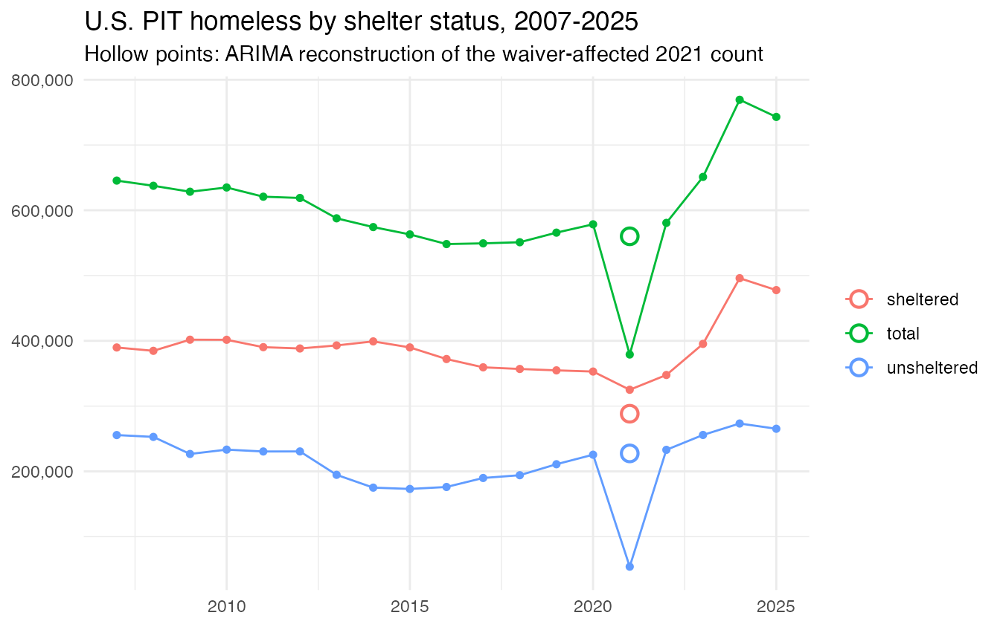
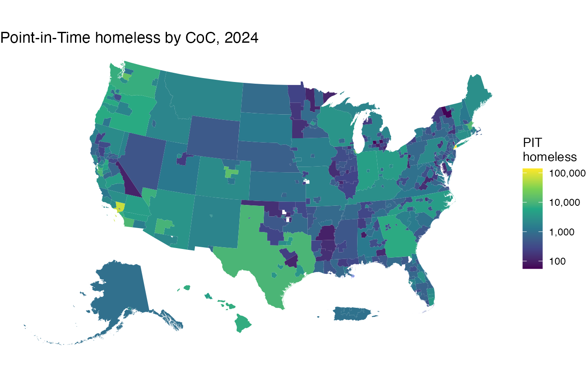
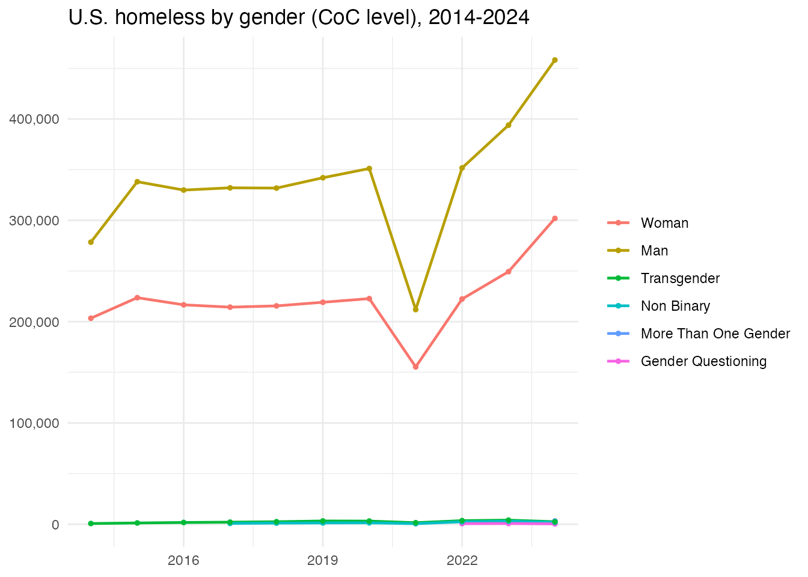
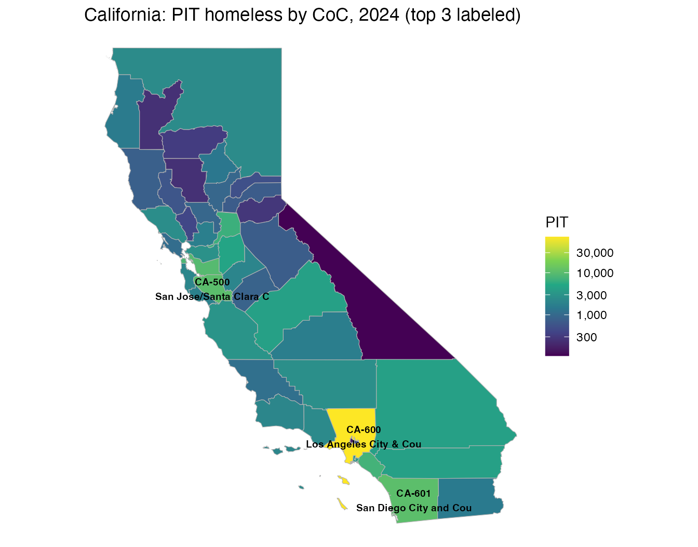
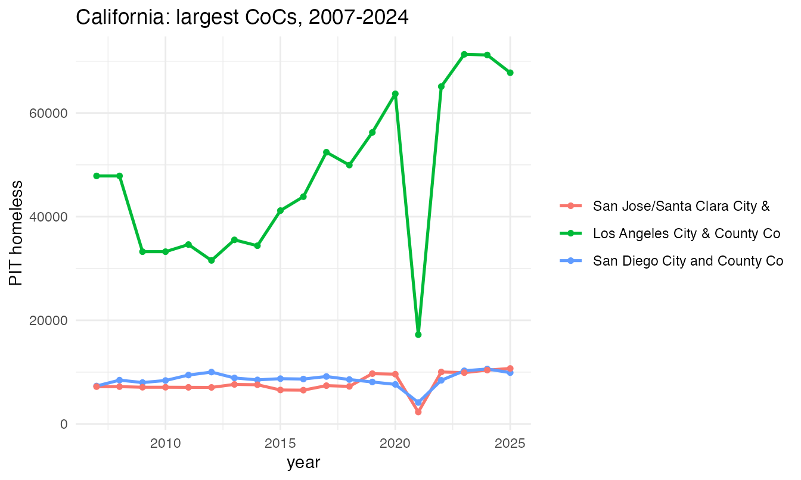
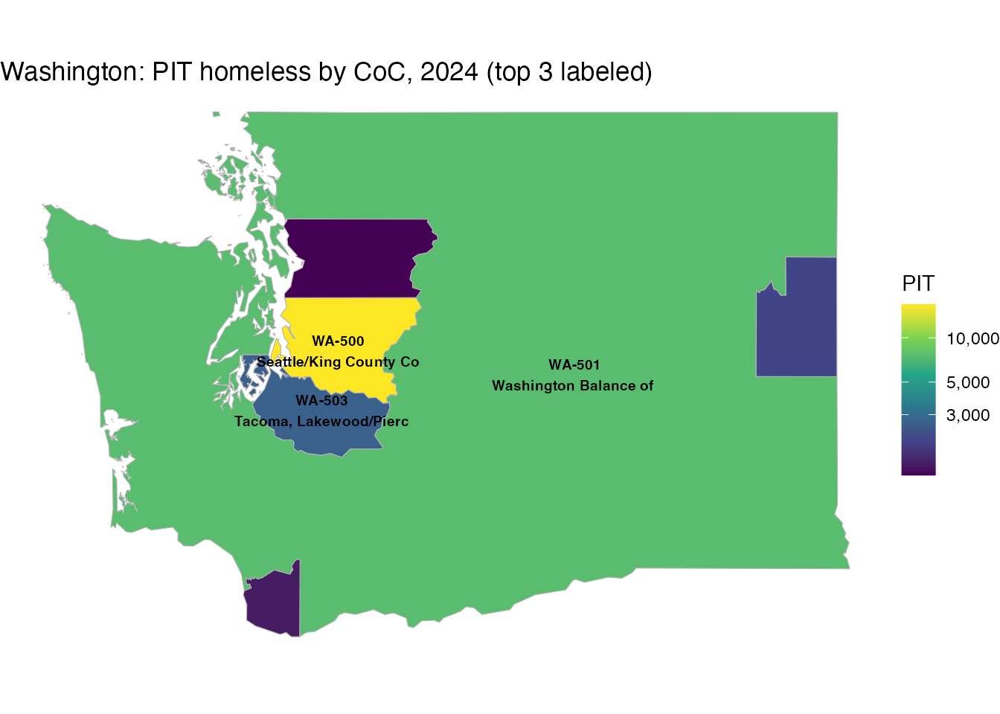
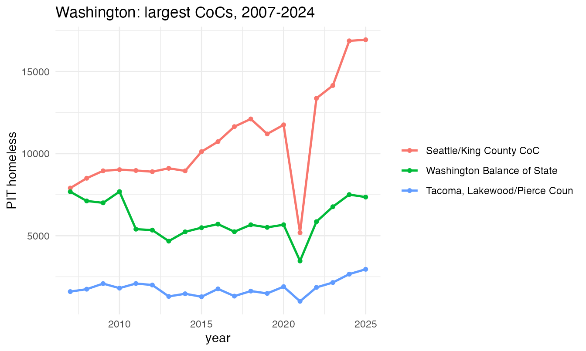

# CoC Point-in-Time homeless counts

``` r

library(COCHomeless)
```

The `hud2007`–`hud2024` data frames hold HUD’s annual Point-in-Time
(PIT) estimate of the total (“Overall Homeless”) population for each
Continuum of Care (CoC). The `coc2007`–`coc2024` objects hold the
matching CoC boundaries as `sf` polygons.

## National overview

National totals over the full series:

``` r

years <- 2007:2025
totals <- sapply(years, function(y) sum(get(paste0("hud", y))$count))
plot(years, totals / 1e6, type = "b", pch = 19,
     xlab = "Year", ylab = "Total PIT homeless (millions)",
     main = "U.S. Point-in-Time homeless counts, 2007-2024")
```


The 2021 dip reflects HUD’s pandemic waiver of the unsheltered count for
many CoCs, not a real decline.

## Sheltered, unsheltered and total, with ARIMA reconstruction of 2021

`pit_us` splits the national total into sheltered and unsheltered
counts. The 2021 unsheltered count collapsed because of the waiver; the
sheltered count held up. We treat 2021 as missing and reconstruct it for
each series with an ARIMA model (Kalman smoothing via
[`imputeTS::na_kalman`](https://SteffenMoritz.github.io/imputeTS/reference/na_kalman.html)),
shown as hollow points.

``` r

library(ggplot2)
series <- c("total", "sheltered", "unsheltered")
yr <- pit_us$year
# ARIMA-impute the 2021 value of one series (2021 set to NA)
arima_2021 <- function(v) {
  x <- v; x[yr == 2021] <- NA
  as.numeric(imputeTS::na_kalman(ts(x, start = min(yr)), model = "auto.arima"))[yr == 2021]
}
obs <- do.call(rbind, lapply(series, function(s)
  data.frame(year = yr, series = s, value = pit_us[[s]])))
imp <- data.frame(year = 2021, series = series,
                  value = vapply(series, function(s) arima_2021(pit_us[[s]]), numeric(1)))

ggplot(obs, aes(year, value, color = series)) +
  geom_line() + geom_point(size = 1.3) +
  geom_point(data = imp, shape = 21, fill = "white", size = 3.2, stroke = 1.1) +
  scale_y_continuous(labels = scales::comma) +
  labs(title = "U.S. PIT homeless by shelter status, 2007-2025",
       subtitle = "Hollow points: ARIMA reconstruction of the waiver-affected 2021 count",
       y = NULL, x = NULL, color = NULL) +
  theme_minimal()
```



``` r

data.frame(series, observed_2021 = sapply(series, function(s) pit_us[[s]][yr == 2021]),
           arima_2021 = round(imp$value))
#>                  series observed_2021 arima_2021
#> total             total        379055     560133
#> sheltered     sheltered        325027     288340
#> unsheltered unsheltered         54028     227548
```

A national map of 2024, CoCs shaded by PIT count. Alaska and Hawaii are
repositioned with
[`tigris::shift_geometry()`](https://rdrr.io/pkg/tigris/man/shift_geometry.html)
for a compact lower-48 layout:

``` r

library(sf); library(ggplot2); library(tigris)
#> Linking to GEOS 3.14.1, GDAL 3.12.3, PROJ 9.8.0; sf_use_s2() is TRUE
#> To enable caching of data, set `options(tigris_use_cache = TRUE)`
#> in your R script or .Rprofile.
# drop the far Pacific/Caribbean territories (shift_geometry only repositions
# AK/HI/PR) so the map stays centered on the lower 48 + insets
conus <- function(x) x[!x$ST %in% c("AS", "GU", "MP", "VI"), ]
m24 <- conus(merge(coc2024, hud2024, by.x = "COCNUM", by.y = "coc_num"))
m24s <- shift_geometry(m24)
ggplot(m24s) +
  geom_sf(aes(fill = count), color = NA) +
  scale_fill_viridis_c(trans = "log10", name = "PIT\nhomeless",
                       labels = scales::comma) +
  labs(title = "Point-in-Time homeless by CoC, 2024") +
  theme_void()
```



## Homeless by gender over time (CoC level)

`pit_coc_detail` carries HUD’s gender breakdown, available 2014–2024
(dropped from the 2025 release). National totals by gender, summing
across CoCs:

``` r

gen_levels <- c("Woman", "Man", "Transgender", "Non Binary",
                "More Than One Gender", "Gender Questioning")
g <- subset(pit_coc_detail, shelter == "Overall" &
            as.character(subpopulation) %in% gen_levels & !is.na(count))
agg <- aggregate(count ~ year + subpopulation, g, sum)
agg$subpopulation <- factor(as.character(agg$subpopulation), levels = gen_levels)
ggplot(agg, aes(year, count, color = subpopulation)) +
  geom_line(linewidth = 0.8) + geom_point(size = 1) +
  scale_y_continuous(labels = scales::comma) +
  labs(title = "U.S. homeless by gender (CoC level), 2014-2024",
       y = NULL, x = NULL, color = NULL) + theme_minimal()
```



## A helper for the two state examples

``` r

# the 3 largest CoCs in a state in 2024, and a short label for the map
top_cocs <- function(st, n = 3) {
  s <- m24[m24$ST == st, ]
  s <- s[order(-s$count), ][seq_len(n), ]
  s$label <- paste0(s$COCNUM, "\n", substr(s$COCNAME, 1, 22))
  s
}
# state map: all CoCs shaded by count, top 3 labeled by name
state_map <- function(st, title) {
  s <- m24[m24$ST == st, ]
  tp <- top_cocs(st)
  ggplot(s) +
    geom_sf(aes(fill = count), color = "grey70") +
    geom_sf_text(data = tp, aes(label = label), size = 2.6, fontface = "bold") +
    scale_fill_viridis_c(trans = "log10", name = "PIT", labels = scales::comma) +
    labs(title = title) + theme_void()
}
# per-CoC time series 2007-2024 for a set of CoC numbers
coc_series <- function(coc_nums) {
  do.call(rbind, lapply(coc_nums, function(cc) data.frame(
    year = years, COCNUM = cc,
    count = sapply(years, function(y) {
      d <- get(paste0("hud", y)); v <- d$count[d$coc_num == cc]
      if (length(v)) v else NA_real_ }))))
}
```

## California

``` r

state_map("CA", "California: PIT homeless by CoC, 2024 (top 3 labeled)")
#> Warning in st_point_on_surface.sfc(sf::st_zm(x)): st_point_on_surface may not
#> give correct results for longitude/latitude data
```



Year-by-year trend for California’s three largest CoCs:

``` r

ca_top <- top_cocs("CA")
ggplot(coc_series(ca_top$COCNUM), aes(year, count, color = COCNUM)) +
  geom_line(linewidth = 0.9) + geom_point(size = 1.3) +
  scale_color_discrete(labels = setNames(substr(ca_top$COCNAME, 1, 28), ca_top$COCNUM)) +
  labs(title = "California: largest CoCs, 2007-2024", y = "PIT homeless",
       color = NULL) + theme_minimal()
```



## Washington

``` r

state_map("WA", "Washington: PIT homeless by CoC, 2024 (top 3 labeled)")
#> Warning in st_point_on_surface.sfc(sf::st_zm(x)): st_point_on_surface may not
#> give correct results for longitude/latitude data
```



Year-by-year trend for Washington’s three largest CoCs:

``` r

wa_top <- top_cocs("WA")
ggplot(coc_series(wa_top$COCNUM), aes(year, count, color = COCNUM)) +
  geom_line(linewidth = 0.9) + geom_point(size = 1.3) +
  scale_color_discrete(labels = setNames(substr(wa_top$COCNAME, 1, 28), wa_top$COCNUM)) +
  labs(title = "Washington: largest CoCs, 2007-2024", y = "PIT homeless",
       color = NULL) + theme_minimal()
```



CoCs merge and are renumbered over time; use `coc_mergers` to follow a
CoC through a merger (see
[`?coc_mergers`](https://ssdalab.github.io/COCHomeless/reference/coc_mergers.md)).
